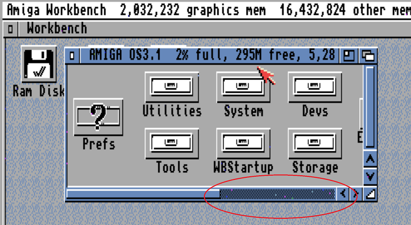
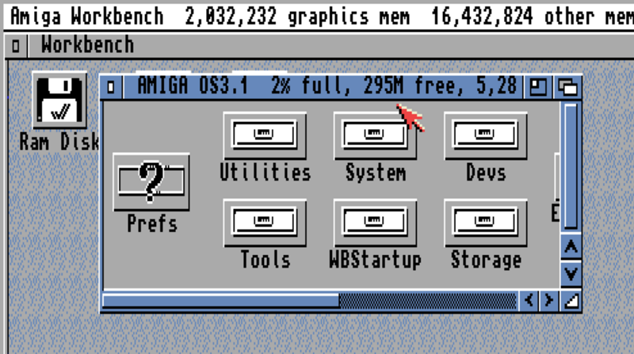

# Amiga Video Slot RGB to HDMI

Add pixel-perfect HDMI output to big box Amiga machines with video slots.

This project builds on c0pperdragon's [Amiga-Digital-Video project](https://github.com/c0pperdragon/Amiga-Digital-Video), adapted for use in big box Amiga video slots.

The main differences are:
- The 7MHZ signal is derived via C1 XNOR C3 using an additional 74LVC86 since 7MHZ is not available directly from the video slot
- Two button connectors allow for both a rear slot cover bracket button and another to be used, mounted wherever desired

The card edge connector used is from [Amiga-KiCad-Library](https://github.com/JustinBaldock/Amiga-KiCad-Library). Approximately 1mm of space is left between the fingers and the PCB edge to allow for beveling.

## Software
- A compatible release of the software is available from the RGBtoHDMI repository 
https://github.com/hoglet67/RGBtoHDMI/releases.
- Unzip the content of the archive to the root folder of a micro SD card, formatted as FAT32, and put in your Raspberry Pi Zero.

## Installation notes
- Set the Denise jumper according to which Denise is in your Amiga (Super Denise for 8373, Denise for 8362)
- Orient the PCB such that the end with bracket mounting holes faces the rear of the machine

## Assembled board example

Here's an example of a completed board with a custom bracket, installed in an A2000:

 

## Board availability
- You can of course build your own if you are confident with a soldering iron. You can find the schematic and other relevant files in the [RGBtoHDMI](https://github.com/hoglet67/RGBtoHDMI) project [here](https://github.com/hoglet67/RGBtoHDMI/tree/master/kicad_AmigaAdapter/VideoSlot/V1).
- I may periodically have extras available and can ship within the U.S., cost and availability TBD. If you are interested in one, you can contact me via (bloodmosher (at) outlook (dot) com) to be added to the list.

## Noise and 'sparkling' on the image
- The most common source of display issues is having an incorrect Denise jumper setting. Make sure you have this set correctly! I have accidentally set this wrong many times myself.
- In some cases the addition of a 47pf capacitor can help eliminate noise, as described [here](https://github.com/c0pperdragon/Amiga-Digital-Video/issues/41#issuecomment-793802678).
- I've tested many boards on A2000, A3000, with both Denise variants, on many different displays. My Predator X27 seems best at surfacing display noise (often visible even when totally invisible on another display), and I have found that the addition of the 47pf capacitor as well as configuration tuning as described below makes the display rock solid on this monitor.
- A future revision of the board may include this capacitor and/or make use of the unused gates on U5 to provide the appropriate signal delay.

## Profile configuration tips
- I recommend using the 1/31/21 release of the software, which can be found [here](https://github.com/hoglet67/RGBtoHDMI/releases/tag/20210131_20ce5f0).
- There can be subtle variations in display quality depending on the board, Amiga, and monitor/TV used. You may need to experiment to get the best results.

For example, the below pictures illustrate output from my Amiga 3000, first with the default configuration, and then with modifications:

## Example Amiga 3000 output before configuration tuning:
- Some subtle "moving pixels" can be seen, in dense hatch patterns of light/dark pixels in particular (circled in red)
- This effect can be very noticeable on one of my monitors, but barely noticeable on another.

## After configuration tuning with the following key changes:
- Settings Menu->Overclock CPU: 40
- Settings Menu->Overclock Core: 170
- Sampling Menu->Sync Edge: Trailing with +ve PixClk

I highly suggest using a heat sink on the Pi with this configuration. Keep an eye on the core temperature (Info Menu->System Summary->Core Temp). Mine runs just under 43C, which is still cooler than my A500 which sits around 47C using the Denise adapter with default settings from the same release (OverClock CPU: 0, OverClock Core: 50).

