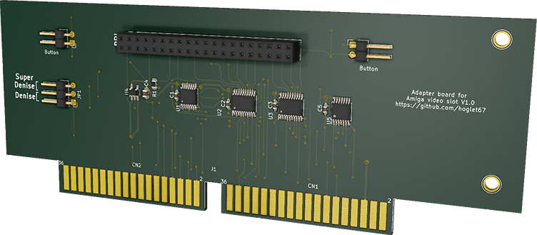
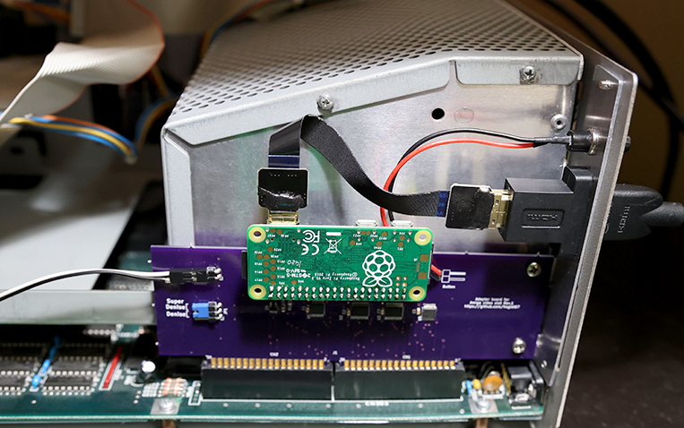

# Amiga Video Slot RGB to HDMI

Add pixel-perfect HDMI output to big box Amiga machines with video slots.

This project builds on c0pperdragon's [Amiga-Digital-Video project](https://github.com/c0pperdragon/Amiga-Digital-Video), adapted for use in big box Amiga video slots.

The main differences are:
- The 7MHZ signal is derived via C1 XNOR C3 using an additional 74LVC86 since 7MHZ is not available directly from the video slot
- Two button connectors allow for both a rear slot cover bracket button and another to be used, mounted wherever desired

The card edge connector used is from [Amiga-KiCad-Library](https://github.com/JustinBaldock/Amiga-KiCad-Library). Approximately 1mm of space is left between the fingers and the PCB edge to allow for beveling.

## Software
- A compatible release of the software is available from the RGBtoHDMI repository 
https://github.com/hoglet67/RGBtoHDMI/releases.
- Unzip the content of the archive to the root folder of a micro SD card, formatted as FAT32, and put in your Raspberry Pi Zero.

## Installation notes
- Set the Denise jumper according to which Denise is in your Amiga (Super Denise for 8373, Denise for 8362)
- Orient the PCB such that the end with bracket mounting holes faces the rear of the machine

## Assembled board example

Here's an example of a completed board with a custom bracket, installed in an A2000:

 

## Board availability
- You can of course build your own if you are confident with a soldering iron. You can find the schematic and other relevant files in the [RGBtoHDMI](https://github.com/hoglet67/RGBtoHDMI) project [here](https://github.com/hoglet67/RGBtoHDMI/tree/master/kicad_AmigaAdapter/VideoSlot/V1).
- I may periodically have extras available and can ship within the U.S., cost and availability TBD. If you are interested in one, you can contact me via (bloodmosher (at) outlook (dot) com) to be added to the list.