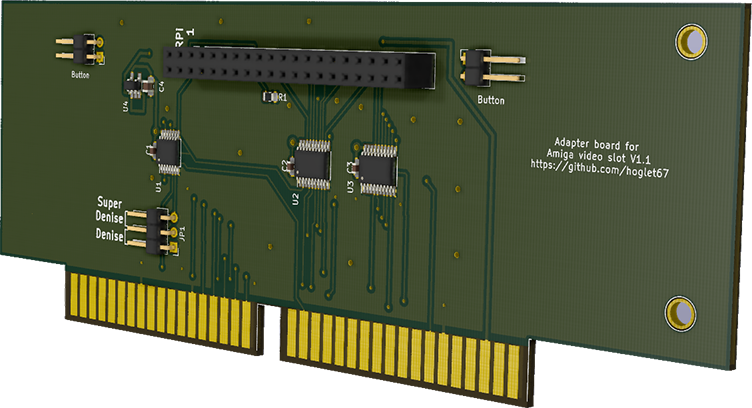
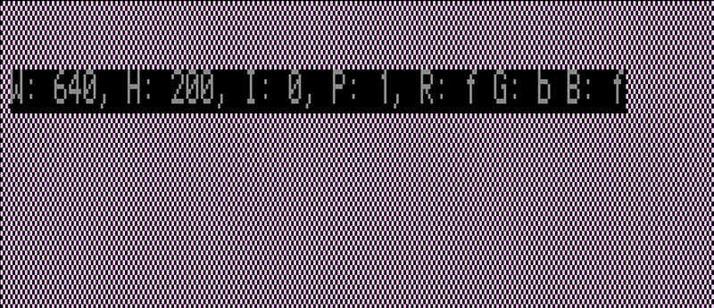
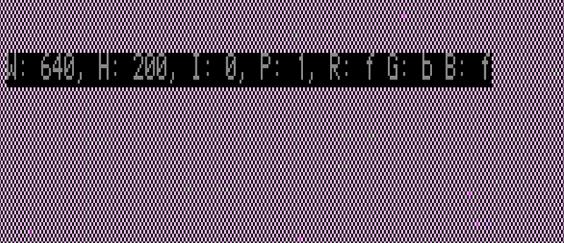

# Amiga Video Slot RGB to HDMI V1.1

Add pixel-perfect HDMI output to big box Amiga machines with video slots.

This project builds on c0pperdragon's [Amiga-Digital-Video project](https://github.com/c0pperdragon/Amiga-Digital-Video), adapted for use in big box Amiga video slots.

The main differences are:
- The 7MHZ signal is derived via C1 XNOR C3 since 7MHZ is not available directly from the video slot
- Two button connectors allow for both a rear slot cover bracket button and another to be used, mounted wherever desired

## Software
- A compatible release of the software is available from the RGBtoHDMI repository 
https://github.com/hoglet67/RGBtoHDMI/releases.
- Unzip the content of the archive to the root folder of a micro SD card, formatted as FAT32, and put in your Raspberry Pi Zero.

## Installation notes
- Set the Denise jumper according to which Denise is in your Amiga (Super Denise for 8373, Denise for 8362)
- The most common source of display issues is having an incorrect Denise jumper setting. Make sure you have this set correctly!
- Orient the PCB such that the end with bracket mounting holes faces the rear of the machine
- On the Amiga 3000 specifically, it is very important to ensure that the riser card PCB connector is clean. If you see a very wavy or unstable picture this is very likely the issue; just remove it and clean the PCB edge with isopropyl alcohol.

## V1.1 Boards
The updated V1.1 board should fix sparkling pixel noise on even the most demanding video patterns (see below for an example). Many thanks to LinuxJedi for demonstrating that alternate layouts have an impact on this. While it is difficult to pinpoint exactly which combination of changes is absolutely necessary, of the numerous experiments I have tried with variations on path length, eliminating through-holes, copper fills, regulator placement, etc. the predominant issue seems to be placement of U1 relative to the other chips. 

- The updated V1.1 schematic and gerber files are available [here](https://github.com/Bloodmosher/RGBtoHDMI/tree/amiga-videoslot-v1_1/kicad_AmigaAdapter/VideoSlot/V1).
- I recommend using the 5/29/21 release of the software, which can be found [here](https://github.com/hoglet67/RGBtoHDMI/releases/tag/20210529_777ea4f).
- The 47pf capacitor, and excessive overclocking settings should no longer be required.

## Test Pattern
- I've found that a 640x200 image with alternating pixel colors is most helpful in verifying that pixel sparkles are eliminated.
- You can download and run the test tool that I have used yourself here: https://github.com/Bloodmosher/AmigaSparkler

Here's an example of a solid picture from the V1.1 board:

Compared to the same on a V1.01 board:

## Assembled board example

Here's an example of a completed board with a custom bracket, installed in an A2000:

 

## Board availability
- You can of course build your own if you are confident with a soldering iron. You can find the schematic and other relevant files [here](https://github.com/Bloodmosher/RGBtoHDMI/tree/amiga-videoslot-v1_1/kicad_AmigaAdapter/VideoSlot/V1).
- For details on the custom bracket and other components used, see [AmigaBrackets](https://github.com/Bloodmosher/AmigaBrackets)

- I may periodically have extras available and can ship within the U.S., cost and availability TBD. If you are interested in one, you can contact me via (bloodmosher (at) outlook (dot) com) to be added to the list.

## V1.01 and V1.0 Boards
- These boards will still work well for most usage if configured correctly, but will exhibit pixel noise on certain test patterns as shown above.
- The 47pf capacitor helps and was includedd in V1.01, and V1.0 boards can easily be updated to include this as described [here](https://github.com/c0pperdragon/Amiga-Digital-Video/issues/41#issuecomment-793802678).
- Try the below configuration changes if you notice any pixel noise (sparkling):
    - Settings Menu->Overclock CPU: 40
    - Settings Menu->Overclock Core: 170
    - Sampling Menu->Sync Edge: Trailing with +ve PixClk
- Make sure you have a heat sink on your Pi!